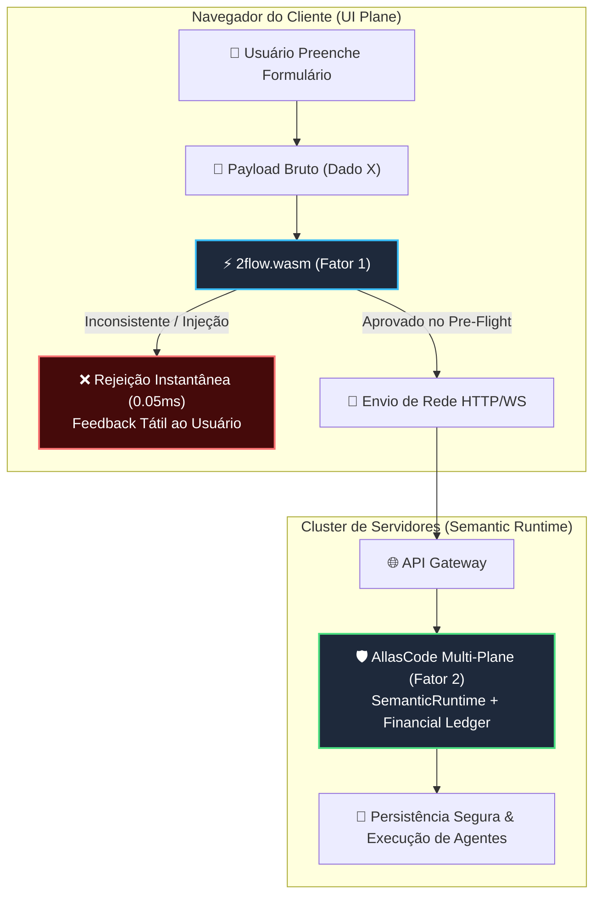
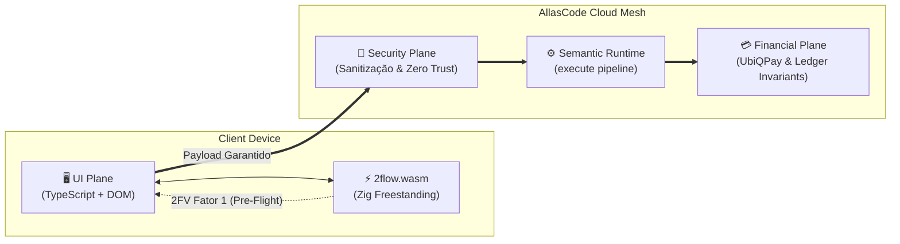

# 🛡️ 2FV (Two-Factor Validation): Pre-Flight Semântico em WebAssembly na Full Agentic Stack AllasCode

> **"Valide no cliente com o mesmo motor do servidor; persista no servidor com prova determinística."**  
> *Conceito nativo da arquitetura AllasCode para erradicação de desperdício computacional em sistemas agênticos e multi-planos.*

---

## 1. Visão Geral e Abstract

Em arquiteturas tradicionais de microsserviços e sistemas orientados a agentes (Agentic Systems), o processo de validação de formulários e payloads padece de dois males estruturais crônicos:

1. **Drift Arquitetural (Descompasso de Regras):** O frontend valida apenas formatações superficiais em JavaScript (regex de e-mail, campos obrigatórios, tamanho mínimo), enquanto as verdadeiras invariantes de negócio e regras semânticas residem exclusivamente no backend.
2. **Sobrecarga Inútil no Cluster de Backend:** Milhões de requisições HTTP chegam aos gateways, atravessam camadas de autenticação, alocam buffers em pools de memória, disparam pods de orquestração e acionam agentes de inteligência artificial ou chamadas de LLM caras, para serem sumariamente rejeitadas em etapas intermediárias por inconsistências que poderiam ter sido diagnosticadas na origem.

O **2FV (Two-Factor Validation)** é a técnica nativa do **AllasCode Full Agentic Stack** que resolve esse problema ao compilar o motor semântico de validação do backend diretamente para **WebAssembly (WASM)**.



---

## 2. O Que é o 2FV (Two-Factor Validation)?

Assim como o *Two-Factor Authentication* (2FA) exige dois fatores de prova para identidade, o **2FV (Two-Factor Validation)** estabelece que nenhum payload é processado no ecossistema AllasCode sem aprovação por dois fatores determinísticos independentes:

### 🔹 Fator 1: Client-Side Pre-Flight via WebAssembly (Prevenção Local)
- **Onde ocorre:** No dispositivo do usuário (Browser, Mobile WebView ou Edge CDN Worker), antes de abrir qualquer socket de rede.
- **Como opera:** O frontend carrega o módulo `2flow.wasm` (gerado diretamente do código-fonte do backend em Zig). O motor executa a topologia declarativa `.2flow`, as ferramentas de sanitização e as regras de domínio.
- **Resultado:** Se houver payload malicioso (`<script>`, SQLi, bytes nulos), CNPJ inválido, valores monetários negativos ou saldo incompatível, o cliente barra o envio **instantaneamente**.
- **Custo:** **0 chamadas de rede**, **0 processamento no servidor**, **0.05ms de latência**.

### 🔹 Fator 2: Server-Side Deterministic Proof & Ledger Persistence (Autoridade Final)
- **Onde ocorre:** No runtime do backend (`Framework/src/runtime/SemanticRuntime.ts`, Austral, Zig, Haskell, Financial Plane).
- **Como opera:** O servidor recebe um payload já validado pelo Fator 1. Ele executa a validação autoritativa final com chaves criptográficas assimétricas, verificação de concorrência com o banco transacional, emissão de provas de convergência matemática e gravação no ledger contábil.
- **Resultado:** O backend não gasta tempo com validações triviais; ele foca estritamente na conciliação atômica de estado.

---

## 3. Métricas Reais de Eficiência Operacional

A implementação do 2FV com o motor **2flow** em Zig 0.16 gera métricas expressivas de economia de recursos e performance:

| Métrica | Arquitetura Tradicional (Single-Factor) | Arquitetura 2FV AllasCode (WASM + Native) | Ganho Obtido |
| :--- | :--- | :--- | :--- |
| **Desperdício de CPU no Backend** | 100% dos payloads com erro atingem o servidor | **Mais de 90% do processamento de invalidação é poupado** | **> 90% de alívio no cluster** |
| **Latência de Rejeição de Erros** | 150ms a 400ms (Round-Trip HTTP + Gateway + DB) | **0.05ms** (Execução local em WebAssembly) | **~5000x mais veloz** |
| **Consumo de Banda de Rede** | Envia payloads inválidos com anexos e textos | Bloqueio no navegador sem tráfego de dados | **Redução direta de tráfego** |
| **Tamanho do Módulo Validador** | Bibliotecas JS pesadas (Yup/Zod/Joi: 50KB - 200KB) | **`2flow.wasm` freestanding: ~2.7 KB** | **98% menor que libs JS** |
| **Drift de Regras de Negócio** | Alto (código duplicado em TS no front e Zig no back) | **Zero Drift** (Mesmo código Zig compilado para WASM) | **Integridade Total (SSOT)** |
| **Custo de Inferência em Agentes** | Payloads quebrados ativam prompts caros de LLMs | LLMs só recebem dados já comprovados no Fator 1 | **Economia direta de tokens** |

> [!IMPORTANT]
> **A Regra dos 90%**: Mais de 90% das falhas de submissão em formulários corporativos (dados cadastrais, CNPJs digitados incorretamente, números fora de escala, injeções acidentais e campos vazios) são interceptadas pelo Fator 1 no browser. O cluster de produção opera com quase 100% de taxa de conversão bem-sucedida.

---

## 4. Integração com a Arquitetura Multi-Plano do AllasCode

O AllasCode é estruturado em 10 planos semânticos (`Multi-Planes.md`). O 2FV atua como o elo de ligação entre os planos:



1. **UI Plane (Frontend):** Carrega o módulo `2flow.wasm` e o expõe via API simples para os componentes visuais.
2. **Security Plane:** Garante que tentativas de bypass do Fator 1 (ex: requisições manuais via `curl`) sejam sumariamente barradas pelo Fator 2 com as mesmas regras determinísticas.
3. **Financial Plane:** Assegura que invariantes monetários (`amount > 0`, `currency`, `reconciliation`) sejam antecipados na digitação do operador antes do faturamento.

---

## 5. Exemplo Prático de Consumo no Frontend (JavaScript / TypeScript)

O arquivo `2flow.wasm` gerado pelo Makefile pode ser instanciado em qualquer aplicação web moderna em menos de 10 linhas de código:

```typescript
// Carregamento ultra-rápido do módulo WebAssembly (apenas 2.7 KB)
const response = await fetch('/wasm/2flow.wasm');
const { instance } = await WebAssembly.instantiateStreaming(response);
const { wasm_alloc, wasm_reset_heap, validate_2fv_data_pipeline, memory } = instance.exports;

function submitFormularioCom2FV(textoEntrada: string) {
  const encoder = new TextEncoder();
  const bytes = encoder.encode(textoEntrada);

  // 1. Aloca memória compartilhada na heap do WASM
  const ptr = wasm_alloc(bytes.length);
  const heap = new Uint8Array(memory.buffer, ptr, bytes.length);
  heap.set(bytes);

  // 2. FATOR 1: Executa o Pre-Flight do backend dentro do navegador
  const status2FV = validate_2fv_data_pipeline(ptr, bytes.length);
  wasm_reset_heap();

  if (status2FV === 1) {
    // APROVADO NO FATOR 1: Envia com garantia de sucesso para o servidor
    console.log("✅ [2FV Fator 1] Payload aprovado no pre-flight local!");
    return fetch('/api/v1/eventos', {
      method: 'POST',
      headers: { 'Content-Type': 'application/json', 'X-2FV-Preflight': 'PASSED' },
      body: JSON.stringify({ raw_text: textoEntrada })
    });
  } else if (status2FV === -2) {
    alert("🚨 [2FV Bloqueio] Tentativa de injeção de script detectada pelo motor 2flow!");
    return;
  } else {
    alert("⚠️ [2FV Bloqueio] Payload inválido ou incompleto. Corrija antes de enviar.");
    return;
  }
}
```

---

## 6. Como Compilar via Makefile

O repositório inclui um `Makefile` configurado para automatizar todo o ciclo:

```bash
# Compilar o módulo WebAssembly 2FV para o frontend (ReleaseSmall: 2.7 KB)
make wasm

# Executar a suíte de testes unitários do validador WASM no Zig 0.16
make test-wasm

# Executar todos os testes do ecossistema (WASM + Data Pipeline + Empresa Agêntica)
make test-all
```

Saída da compilação:
```text
📦 [2flow 2FV] Compilando WebAssembly para Pre-Flight no Frontend (ReleaseSmall)...
zig build-exe wasm.zig -target wasm32-freestanding -O ReleaseSmall -rdynamic --name 2flow
✅ [2flow 2FV] Módulo WebAssembly gerado com sucesso: 2flow.wasm (2757 bytes)
```

---

## 7. Conclusão

O **2FV (Two-Factor Validation)** do **AllasCode** redefine a fronteira entre cliente e servidor. Ao transformar o navegador em um ambiente de execução semântica idêntico ao servidor via WebAssembly:
- Elimina-se a duplicidade de código;
- Reduz-se em mais de **90% a carga inútil de invalidação nos servidores**;
- Oferece-se ao usuário uma interface ultra-rápida, resiliente e imune a submissões malformadas.
