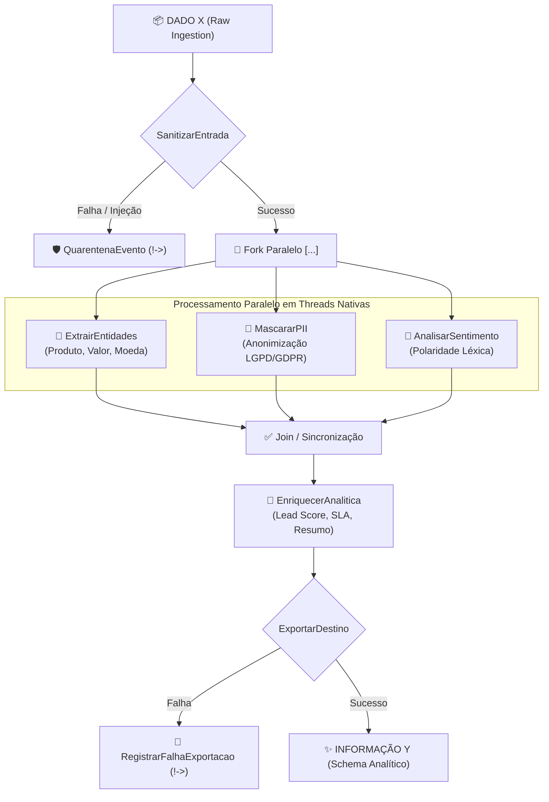

# 🌊 Modern Data Pipeline em 2flow (Zig 0.16)

Exemplo completo de um dos pipelines de engenharia de dados mais utilizados no mercado atual: **Ingestão de Eventos Brutos, Sanitização, Extração Concorrente de Entidades, Anonimização LGPD/GDPR, Análise Léxica de Sentimento, Enriquecimento de Negócio e Exportação Estruturada com Fallback de Quarentena (Saga Pattern)**.

Construído utilizando a notação declarativa **2flow**, compilado em 100% **Comptime** e executado com **Zero Runtime Overhead** e **concorrência nativa de threads** em **Zig 0.16**.

---

## 🎯 Cenário de Negócio: Transformação de Dado X em Informação Y

No mundo real de plataformas de e-commerce, telemetria, CRMs e data lakes, os dados chegam de forma desestruturada, suja e com dados de privacidade expostos (webhooks de pagamento, mensagens de checkout, logs de suporte).

O papel deste pipeline é transformar um **Dado Bruto X** em uma **Informação Analítica Acionável Y**:



---

## 🔄 A Transformação: Dado X ➡️ Informação Y

### 1. Dado X de Entrada (Payload Bruto Não Estruturado)
```text
"   PEDIDO CONFIRMADO!! Compra de Servidor Cloud 64GB no valor de 4500.00 EUR pelo cliente Carlos Silva (carlos.silva@techcorp.com), IP 192.168.1.55. Entrega urgente solicitada!   "
```
* **Problemas do Dado X:**
  - Espaços desnecessários e ruídos de formatação.
  - Dados Pessoais Identificáveis (PII) expostos (`carlos.silva@techcorp.com` e IP `192.168.1.55`) violando a LGPD.
  - Informações de produto e valor misturadas em texto livre.
  - Sem classificação de urgência, sentimento ou SLA.

---

### 2. Informação Y de Saída (JSON Analítico e Conforme LGPD)
```json
{
  "evento_id": "EVT-89210-PROD",
  "status": "PROCESSADO_COM_SUCESSO",
  "cliente_lgpd": "c****a@techcorp.com",
  "origem_ip": "192.168.*.*",
  "produto": "Servidor Cloud 64GB",
  "valor": 4500.00,
  "moeda": "EUR",
  "sentimento": "POSITIVO",
  "score_sentimento": 0.70,
  "prioridade": "CRITICA",
  "lead_score": 100,
  "sla_minutos": 15,
  "resumo_executivo": "[CRITICA] Pedido de 'Servidor Cloud 64GB' no montante de 4500.00 EUR. Cliente: c****a@techcorp.com. Sentimento: POSITIVO."
}
```

---

### 3. Tabela Comparativa de Transformação

| Dimensão | Dado X (Entrada) | Informação Y (Saída 2flow) |
| :--- | :--- | :--- |
| **Estrutura** | Texto bruto ruidoso | JSON Tipado pronto para Data Lake / CRM |
| **Conformidade LGPD** | `carlos.silva@techcorp.com` (Vazado) | `c****a@techcorp.com` (Pseudonimizado) |
| **Origem de Rede** | `192.168.1.55` (Exposto) | `192.168.*.*` (Máscara de Sub-rede) |
| **Entidade de Produto** | Texto livre no meio da frase | `Servidor Cloud 64GB` (Isolado e indexável) |
| **Métrica Financeira** | Caracteres `'4500.00 EUR'` | `4500.00` (`f64`) + `EUR` (`[]const u8`) |
| **Sentimento** | Inexistente | `POSITIVO` (Score: `+0.70`) |
| **Regra de Negócio / SLA** | Nenhuma | Prioridade `CRITICA`, Lead Score `100`, SLA `15 min` |
| **Segurança e Fallback** | Nenhuma proteção | Rota `!-> QuarentenaEvento` se payload contiver injeções |

---

## 📜 Especificação do Fluxo (`config.2flow`)

O arquivo [config.2flow](file:///d:/www/Freelas/_____suissadev/Conceitos/AllasCode/Concepts/2flow/repo/examples/data-pipeline/config.2flow) define a topologia do pipeline de forma limpa e declarativa:

```2flow
SanitizarEntrada !-> QuarentenaEvento
  :--: [ExtrairEntidades, MascararPII, AnalisarSentimento]
  :--: EnriquecerAnalitica
  :--: ExportarDestino !-> RegistrarFalhaExportacao
```

### Operadores 2flow Utilizados:
1. `:--:` (**Sequência Linear**): Garante que a etapa anterior termine com sucesso antes de passar o estado para a próxima.
2. `[...]` (**Fork-Join Paralelo**): Dispara `ExtrairEntidades`, `MascararPII` e `AnalisarSentimento` concorrentemente em threads nativas do Zig, reunindo os resultados na barreira antes de continuar.
3. `!->` (**Saga Fallback / Compensador de Erro**): Se `SanitizarEntrada` detectar dados corrompidos ou injeção, redireciona imediatamente para `QuarentenaEvento` e cancela a esteira principal.

---

## 🛠️ Ferramentas (Tools) dos Agentes

Todas as ferramentas foram implementadas em [tools.zig](file:///d:/www/Freelas/_____suissadev/Conceitos/AllasCode/Concepts/2flow/repo/examples/data-pipeline/tools.zig):

| Agente | Ferramenta Real Utilizada | Função Prática |
| :--- | :--- | :--- |
| **`SanitizarEntrada`** | `TextSanitizerTool` | Remove quebras/espaços duplicados e rejeita scripts maliciosos/bytes nulos. |
| **`QuarentenaEvento`** | Fallback de Saga | Isola o payload em quarentena com carimbo de motivo para auditoria. |
| **`ExtrairEntidades`** | `EntityExtractorTool` | Identifica marcadores de produto, converte valor monetário em `f64` e identifica a moeda. |
| **`MascararPII`** | `PiiMaskerTool` | Anonimiza e-mails (`c****a@dominio.com`) e endereços IP (`192.168.*.*`) para LGPD/GDPR. |
| **`AnalisarSentimento`** | `SentimentAnalyzerTool` | Analisador léxico que calcula pontuação de polaridade positiva/negativa. |
| **`EnriquecerAnalitica`** | `AnalyticsEnricherTool` | Consolida métricas, define SLA e prioridade baseado no valor e urgência. |
| **`ExportarDestino`** | `DataSinkWriterTool` | Serializa o schema final limpo em JSON pronto para persistência. |
| **`RegistrarFalhaExportacao`** | Fallback de Saga | Alerta operacional caso a persistência externa falhe. |

---

## 🚀 Como Executar

### 1. Executar o Pipeline
No diretório `Concepts/2flow/repo/examples/data-pipeline/`:

```bash
zig run main.zig
```

### 2. Executar a Suíte de Testes Automatizados (Zig 0.16)
```bash
zig test test_pipeline.zig
```

Você verá a validação das 6 ferramentas unitárias e dos 2 testes de integração (Fluxo Feliz e Rota de Quarentena):
```text
1/8 test_pipeline.test.Tool 1: TextSanitizerTool normaliza espaços e bloqueia injeções...OK
2/8 test_pipeline.test.Tool 2: EntityExtractorTool extrai produto, valor e moeda...OK
3/8 test_pipeline.test.Tool 3: PiiMaskerTool mascara e-mail e IPv4 conforme LGPD...OK
4/8 test_pipeline.test.Tool 4: SentimentAnalyzerTool quantifica polaridade léxica...OK
5/8 test_pipeline.test.Tool 5: AnalyticsEnricherTool calcula score, SLA e gera resumo executivo...OK
6/8 test_pipeline.test.Tool 6: DataSinkWriterTool serializa JSON analítico tipado...OK
7/8 test_pipeline.test.Pipeline 2flow: Fluxo Feliz (Dado X bruto vira Informação Y enriquecida)...OK
8/8 test_pipeline.test.Pipeline 2flow: Saga e Quarentena via !-> em caso de Dado X corrompido...OK
All 8 tests passed.
```
