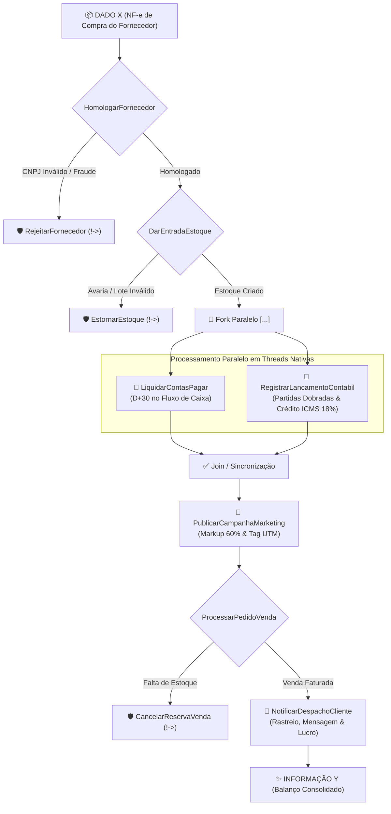

# 🏢 Micro-Empresa Agêntica em 2flow (Zig 0.16)

Exemplo completo de ciclo operacional integrado de ponta a ponta para uma micro-empresa moderna utilizando agentes inteligentes orquestrados pelo motor **2flow**:

$$\text{Fornecedor} \longrightarrow \text{Estoque} \longrightarrow \begin{bmatrix} \text{Financeiro} \\ \text{Contábil} \end{bmatrix} \longrightarrow \text{Marketing} \longrightarrow \text{Vendas} \longrightarrow \text{Cliente}$$

Construído com notação declarativa **2flow**, compilado 100% em **Comptime** e executado com **Zero Runtime Overhead** e **threads nativas** em **Zig 0.16**.

---

## 🎯 Cenário de Negócio: Transformação de Dado X em Informação Y

Em uma micro-empresa tradicional, a chegada de mercadoria envolve múltiplos sistemas desconectados (planilhas, ERPs, CRM, contas a pagar, emissor fiscal). No modelo **Agêntico 2flow**, um único evento de entrada orquestra toda a empresa:



---

## 🔄 A Transformação: Dado X ➡️ Informação Y

### 1. Dado X de Entrada (Nota Fiscal de Compra Bruta do Fornecedor)
```text
NF-e #44921
Fornecedor: TechParts Distribuicao Ltda (CNPJ: 12.345.678/0001-90)
Item: Teclado Mecanico RGB Pro (50 unidades)
Valor Total: R$ 5.000,00 (Prazo: 30 dias)
```
* **Estado Inicial do Dado X:**
  - O fornecedor ainda não foi checado na base cadastral/fiscal.
  - As mercadorias não possuem SKU interno nem inventário criado.
  - A fatura não está provisionada no fluxo de caixa.
  - Nenhum crédito de ICMS foi apropriado pela contabilidade.
  - Não há preço de venda estabelecido, anúncio no ar ou cliente atendido.

---

### 2. Informação Y de Saída (Ciclo Consolidado com Lucro Apurado)
```json
{
  "status_ciclo": "PRODUTO_VENDIDO_E_CLIENTE_NOTIFICADO",
  "produto_sku": "TECLADO-MECANICO-LOTE1",
  "custo_unitario_aquisicao": 100.00,
  "preco_venda_praticado": 160.00,
  "contas_a_pagar": "AGENDADO_D30",
  "credito_tributario_icms": 900.00,
  "venda_faturada": {
    "pedido_id": "PED-88121",
    "cliente": "Mariana Souza",
    "unidades": 2,
    "receita_bruta": 320.00,
    "lucro_bruto": 120.00,
    "margem_liquida": "37.5%"
  },
  "logistica_entrega": {
    "codigo_rastreio": "BR-TRK-918231",
    "canal_notificado": "mariana.souza@cliente.com.br"
  }
}
```

---

### 3. Tabela Comparativa de Transformação

| Departamento / Etapa | Dado X (Origem da Compra) | Informação Y (Ciclo Empresarial 2flow) |
| :--- | :--- | :--- |
| **1. Compras (Fornecedor)** | TechParts (CNPJ não validado) | Homologado e Habilitado fiscalmente |
| **2. Almoxarifado (Estoque)**| 50 un em trânsito sem SKU | SKU `'TECLADO-MECANICO-LOTE1'` (Saldo: 48 un) |
| **3. Financeiro** | Fatura aberta sem agendamento | Agendado D+30 no Contas a Pagar |
| **4. Contabilidade** | Sem apropriação fiscal | **R$ 900,00** de Crédito ICMS recuperável (18%) |
| **5. Marketing** | Custo bruto R$ 100,00 sem precificação | Markup 60% aplicado ➡️ Preço de venda **R$ 160,00** |
| **6. Vendas & Comercial** | Nenhuma venda registrada | Pedido `#PED-88121` faturado por **R$ 320,00** (2 un) |
| **7. Logística / Cliente** | Nenhum cliente atendido | Código de rastreio `BR-TRK-918231` despachado |
| **8. Controladoria** | R$ 5.000,00 comprometidos | **Lucro Bruto R$ 120,00** (Margem Líquida: **37.5%**) |

---

## 📜 Especificação do Fluxo (`config.2flow`)

O arquivo [config.2flow](file:///d:/www/Freelas/_____suissadev/Conceitos/AllasCode/Concepts/2flow/repo/examples/empresa-agentica/config.2flow) define toda a operação da empresa:

```2flow
HomologarFornecedor !-> RejeitarFornecedor
  :--: DarEntradaEstoque !-> EstornarEstoque
  :--: [LiquidarContasPagar, RegistrarLancamentoContabil]
  :--: PublicarCampanhaMarketing
  :--: ProcessarPedidoVenda !-> CancelarReservaVenda
  :--: NotificarDespachoCliente
```

### Operadores Utilizados:
1. `:--:` (**Sequência Linear**): A cadeia de suprimentos avança estritamente após a conclusão bem-sucedida do estágio anterior.
2. `[...]` (**Fork-Join Concorrente**): O departamento **Financeiro** e o **Contábil** processam a NF-e simultaneamente em threads nativas do Zig, com sincronização em barreira.
3. `!->` (**Sagas e Compensadores**):
   - Fornecedor rejeitado ➡️ Estorno e recusa na portaria com devolução fiscal.
   - Pedido de venda inválido / sem estoque ➡️ Cancelamento automático da reserva.

---

## 🛠️ Ferramentas (Tools) dos Agentes

Implementadas em [tools.zig](file:///d:/www/Freelas/_____suissadev/Conceitos/AllasCode/Concepts/2flow/repo/examples/empresa-agentica/tools.zig):

| Agente | Ferramenta Real | Efeito no Mundo Real |
| :--- | :--- | :--- |
| **`HomologarFornecedor`** | `FornecedorTool` | Validação cadastral de CNPJ e coerência da Nota Fiscal de entrada. |
| **`DarEntradaEstoque`** | `EstoqueTool` | Geração do código SKU, cálculo do custo unitário e definição do ponto de reposição. |
| **`LiquidarContasPagar`** | `FinanceiroTool` | Provisionamento de pagamento D+30 e projeção no fluxo de caixa. |
| **`RegistrarLancamentoContabil`** | `ContabilTool` | Escrituração de partidas dobradas (D: Ativo / C: Passivo) e apuração de crédito fiscal de ICMS (18%). |
| **`PublicarCampanhaMarketing`** | `MarketingTool` | Precificação por Markup (60%), geração de links com tags UTM e copy promocional. |
| **`ProcessarPedidoVenda`** | `VendasTool` | Checagem de disponibilidade, emissão do pedido e dedução atômica do estoque. |
| **`NotificarDespachoCliente`** | `ClienteTool` | Geração de código de rastreamento logístico, notificação e apuração da margem líquida. |
| **Compensadores Saga** | Sagas de Estorno | Rollback de inventário, cancelamento de reserva e recusa fiscal de mercadorias. |

---

## 🚀 Como Executar

### 1. Executar o Ciclo Empresarial
No diretório `Concepts/2flow/repo/examples/empresa-agentica/`:

```bash
zig run main.zig
```

### 2. Executar os Testes Automatizados (Zig 0.16)
```bash
zig test test_empresa.zig
```

Saída da suíte de 9 testes (7 unitários + 2 de integração com Sagas):
```text
1/9 test_empresa.test.Tool 1: FornecedorTool valida CNPJ e consistência de valores...OK
2/9 test_empresa.test.Tool 2: EstoqueTool gera SKU, calcula custo unitário e ponto de reposição...OK
3/9 test_empresa.test.Tool 3: FinanceiroTool agenda obrigação no Contas a Pagar...OK
4/9 test_empresa.test.Tool 4: ContabilTool calcula crédito de imposto (18% ICMS) e partidas dobradas...OK
5/9 test_empresa.test.Tool 5: MarketingTool calcula markup de 60% e gera URL com UTM...OK
6/9 test_empresa.test.Tool 6: VendasTool processa fechamento e deduz estoque com segurança...OK
7/9 test_empresa.test.Tool 7: ClienteTool gera rastreio e apura margem líquida...OK
8/9 test_empresa.test.Pipeline 2flow: Ciclo Empresarial Completo de Ponta a Ponta...OK
9/9 test_empresa.test.Pipeline 2flow: Saga !-> RejeitarFornecedor ao identificar CNPJ inválido...OK
All 9 tests passed.
```
